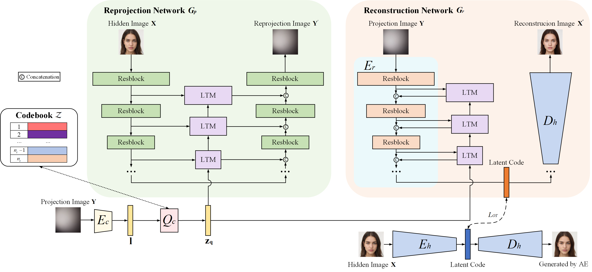

<h3 align="center"><strong>Passive Non-Line-of-Sight Imaging with Light Transport Modulation</strong></h3>

  <p align="center">
    <a href="">Jiarui Zhang</a>,
    <a href="">Ruixu Geng</a>,
    <a href="">Xiaolong Du</a>,     
    <a href="">Yan Chen</a>,
    <a href="">Houqiang Li</a>,
    <a href="">Yang Hu</a>
    <br>
    University of Science and Technology of China
    <br>
    <b>IEEE TIP accepted</b>

</p>

<div align="center">
 <a href='https://arxiv.org/abs/2312.16014'></a> &nbsp;&nbsp;&nbsp;&nbsp;&nbsp;
<!-- <a href='https://arxiv.org/abs/[]'></a> &nbsp;&nbsp;&nbsp;&nbsp;&nbsp; -->
 <a href='LICENSE'></a> &nbsp;&nbsp;&nbsp;&nbsp;&nbsp;
 <br>
 <br>
</div>

<p align="center">

</p>

> Architecture of the proposed NLOS-LTM method for passive NLOS imaging. A reprojection network $G_p$ that reprojects the hidden image to the projection image, and a reconstruction network $G_r$ that reconstructs the hidden image from the projection image are jointly learned during training. We use an encoder $E_c$ and a vector quantizer $Q_c$ to obtain a latent representation of the light transport condition associated with the projection image, which is then used to modulate the feature maps of the reprojection and the reconstruction networks through a set of light transport modulation (LTM) blocks. We also pretrain an auto-encoder, which consists of $E_h$ and $D_h$, with the hidden images. The decoder $D_h$ of the auto-encoder is taken as the decoder part of $G_r$. During testing, only $E_c$, $Q_c$ and $G_r$ are needed for NLOS reconstruction. 

## Data preparation 
### step1
You can place the dataset or a shortcut to the dataset in the datasets folder, and it can be accessed via the `.txt` file, which contains entries like:
```bash
# train
datasets/NLOS_Passive/Supermodel/B/train/7550.png
datasets/NLOS_Passive/Supermodel/B/train/7922.png

# val
datasets/NLOS_Passive/Supermodel/test/gt_val/5485_1.png
datasets/NLOS_Passive/Supermodel/test/gt_val/5478_1.png

#test
datasets/NLOS_Passive/Supermodel/test/gt_test/5592_1.png
datasets/NLOS_Passive/Supermodel/test/gt_test/5921_1.png

```
Alternatively, you can read the dataset directly from the `folder` or or use methods such as `.lmdb` or other approaches
### step2
Similar to step 1, the dataset can be loaded from a .txt file, a folder, .lmdb, or other methods.

## Training
To train NLOS-LTM, you can begin the training by:
```python
# step1
CUDA_VISIBLE_DEVICES=0 python -m torch.distributed.launch --nproc_per_node=1 --master_port=4201  --use_env basicsr/train.py -opt options/train/Supermodel.yml --launcher pytorch

# step2
CUDA_VISIBLE_DEVICES=0 python -m torch.distributed.launch --nproc_per_node=1 --master_port=4201 --use_env basicsr/train.py -opt options/train/Supermodel.yml --launcher pytorch
```
## Evaluation
To evaluate NLOS-LTM, you can run:
```python
# step1
CUDA_VISIBLE_DEVICES=0 python -m torch.distributed.launch --nproc_per_node=1 --master_port=4201 basicsr/test.py -opt ./options/test/Supermodel.yml --launcher pytorch

# step2
CUDA_VISIBLE_DEVICES=0 python -m torch.distributed.launch --nproc_per_node=1 --master_port=4201 --use_env basicsr/test.py -opt ./options/test/S-C_dark_1_d100_wall.yml --launcher pytorch

```


## Citation

If you find our work useful in your research, please consider citing:
```
@ARTICLE{nlosltm,
  author={Zhang, Jiarui and Geng, Ruixu and Du, Xiaolong and Chen, Yan and Li, Houqiang and Hu, Yang},
  journal={IEEE Transactions on Image Processing}, 
  title={Passive Non-Line-of-Sight Imaging with Light Transport Modulation}, 
  year={2024},
  volume={},
  number={},
  pages={1-1},
  keywords={Imaging;Image reconstruction;Nonlinear optics;Image restoration;Relays;Image resolution;Degradation;Computational modeling;Cameras;Surface reconstruction;Non-line-of-sight imaging;light transport conditions},
  doi={10.1109/TIP.2024.3518097}}
```